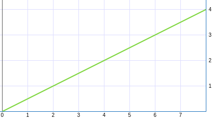

# HOF: Функции высшего порядка (higher-order function). Часть 3

## Отображение (mapping)

[Пишем функцию для фильтрации массива](../hof-2)

Продолжим примеры с яблоками и волшебными машинами, которые могут
делать с этими прекрасными фруктами разные вещи.

Что, если мы хотим функцию, которая будет очищать яблоки, от кожуры, 
косточек, червячков и семечек?

Для обозначения червивости у нас есть "флаг" - `wormEaten`, давайте для
очищенности будем использовать `peeled`.

Сперва объявим функцию, которая будет "очищать" яблоки.

```javascript
const peelApple = apple => {
    const peeledApple = Object.assign({}, apple, {
        wormEaten: false,
        peeled: true,
    });
    
    return peeledApple;
};
```

Может показаться, что мы здесь делаем что-то сложное, но это не так.

Разберём по порядку:
1. Мы объявили функцию `peelApple`, которая получает на вход объект яблока.
2. Внутри мы создаём новый объект, используя 
[`Object.assign`](https://developer.mozilla.org/ru/docs/Web/JavaScript/Reference/Global_Objects/Object/assign).
3. Этот объект формируется из 
    * пустого `{}` объекта, который заполняется свойствами, переданных далее
    объектов
    * объекта `apple`
    * объекта, свойства которого, добавляются в результирующий
4. Возвращаем `peeledApple`

Вот как выглядит использование такой функции:

```javascript
const wormEatenApple = {
    color: 'red',
    size: 'big',
    wormEaten: true,
};

const peeledApple = peelApple(wormEatenApple);

console.log(peeledApple); // {color: "red", size: "big", wormEaten: false, peeled: true}
```

Как мы видим, нам вернулось очищенное(`peeled: true`) яблоко без червей(`wormEaten: false`).

Разумеется, мы хотим работать с коллекциями подобных объектов, поэтому нам нужна функция,
которая будет получать массив и функцию, которая будет обрабатывать каждый объект.

В данном случае функция `filter` нам не подходит.

Существует слово _маппинг_(mapping), что на русском языке звучит как "отображение".
В нашем случае отображение данных.

Что это значит?

Это значит, что есть **множество** каких-то данных, которое после пропускания через определённый
процесс(например функцию), превращается в **другое множество**.

У меня есть несколько примеров, надеюсь, что один или каждый из них будет понятным.

Пример 1.

В школе мы решали примеры со сложением двух чисел, в результате которого получается одно
число.

* 1 + 1 = 2
* 3 + 3 = 6
* 5 + 5 = 10
* 7 + 7 = 14

Одним элементом левого множества можно назвать выражение `1 + 1`, а элементом правого `2`,
но это не совсем правильно в данном случае, так как в левой части указывается **процесс**,
выполняемый над двумя аргументами.

Таким образом отображение можно записать следующим образом:

элемент `[1, 1]`, при применении **функции** `+`, отображается как `2`, а в javascript так:

```javascript
const sum = summands => summands[0] + summands[1];

sum([1, 1]); // 2
sum([3, 3]); // 6
sum([5, 5]); // 10
```

В общем случае это можно записать так: `f(x) -> y`, где 
* f - функция
* x - сущность, передаваемая в функцию
* y - сущность, которую функция возвращает

Те, кто хорошо знают, или хотя бы немного помнят математику,
сразу обнаружат, что это - `f(x) -> y` - выражение им хорошо знакомо.

И из этого вытекает второй пример.

Пример 2.

Взгляните на график:



У нас есть множество значений `x`, и множество значений `y`, таблица которых
выглядит так:

| x | y |
|---|---|
| 0 | 0 |
| 1 |0.5|
| 2 | 1 |
| 3 |1.5|
| 4 | 2 |
| 5 |2.5|
| 6 | 3 |
| 7 |3.5|
| 8 | 4 |

Очевидно, что есть формула, по которой происходит отображение значений `x` на `y`,
и формула эта выглядит так: `f(x) -> x / 2`.

В javascript это можно записать следующим образом:

```javascript
const mapX = x => x / 2;

mapX(0) // 0
mapX(1) // 0.5
mapX(2) // 1
mapX(3) // 1.5
```

Пример 3.

[55.755826, 37.617300] -> Moscow
[51.507351, -0.127758] -> London
[40.712775, -74.005973] -> New-York

Здесь происходит отображение координат на название города.
Код этого отображения гораздо сложнее, чем в предыдущих примерах, и здесь я его
приводить не буду, но надеюсь, что вы уловили суть выражения 
"отображение данных" (data mapping).

Вернёмся к нашим яблокам.

Функция отображения данных у нас уже есть, это `peelApple`.
Но нам нужно уметь работать со множествами, да ещё желательно без
использования циклов, чтобы код читался легко, приятно и понятно.

Писать в коде `mapping` слишком долго =), поэтому существует
простое название: `map`.

Опишем эту функцию.

```javascript
const map = (mapFn, array) => {
    const result = []; // Массив отображённых данных
    
    for (let i = 0; i < array.length; i++) {
        const item = array[i];
        const mappedItem = mapFn(item);
        result.push(mappedItem);
    }
    
    return result;
};

// Добавим немного яблок =)

const apples = [
    {
        color: 'red',
        size: 'medium',
        wormEated: true,
    },
    {
        color: 'green',
        size: 'small',
        wormEated: false,
    },
    {
        color: 'yello',
        size: 'big',
        wormEated: true,
    },
];

const peeledApples = map(peelApple, apples);
```